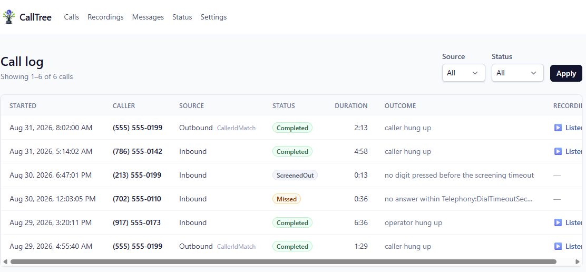
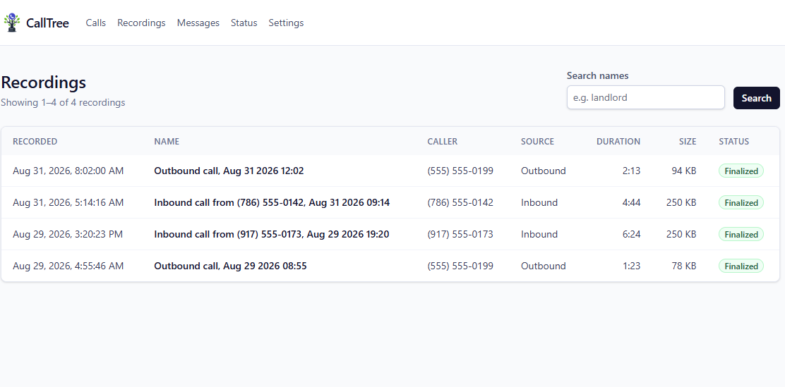
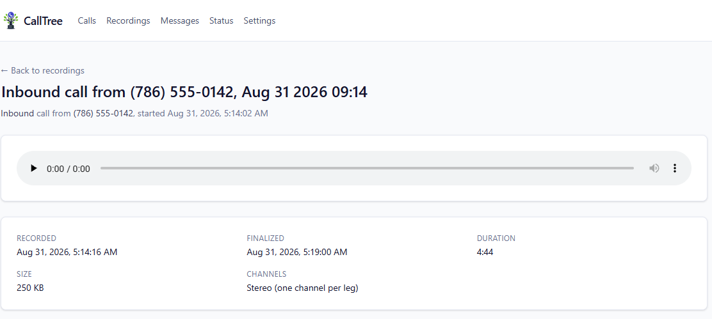
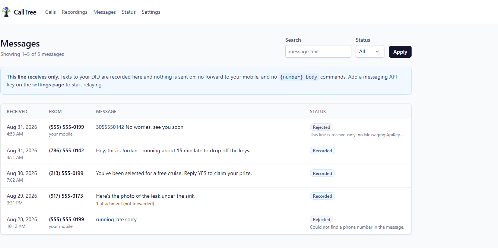
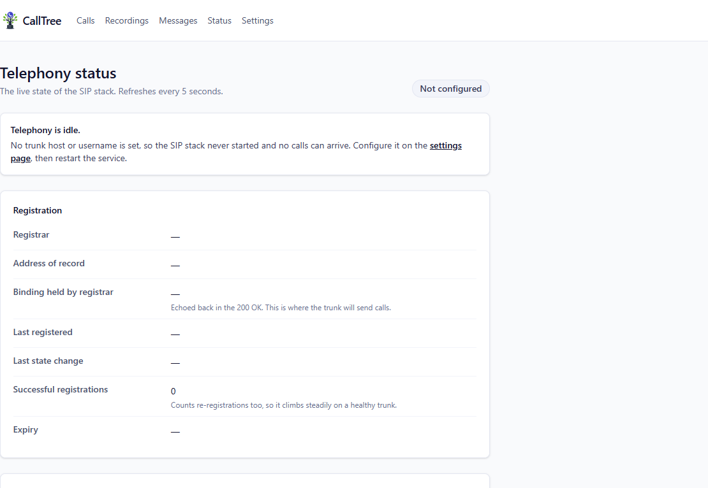
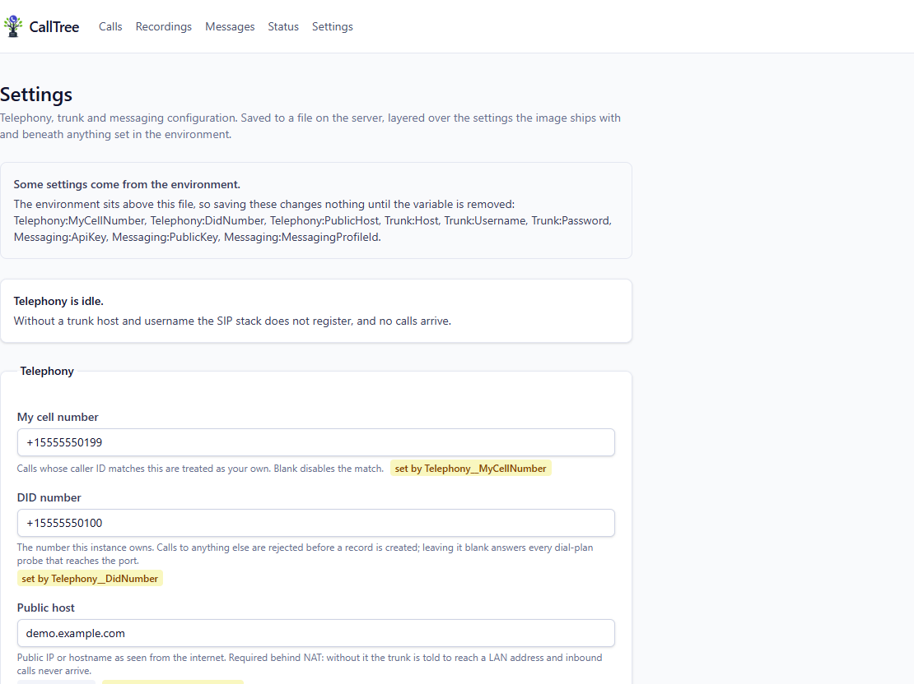

<p align="center"></p>

# CallTree

A self-hosted VoIP server for your homelab: one SIP phone number, screened, recorded, and logged, all
running on hardware you control. CallTree turns away callers who won't press a button to get through,
records the calls worth keeping — including your own, via your phone's normal three-way merge — bridges
screened-in callers to your mobile, and forwards the texts sent to your number. Every call and message lands
in a call log and recordings browser you run yourself, not a third party's database.

Under the hood, it's a self-hosted call recorder and bridge PBX built on a **from-scratch SIP user agent**.
It is deliberately **not** a wrapper around Asterisk, FreeSWITCH or PJSIP: signalling, media, DTMF and
recording are implemented directly against [SIPSorcery](https://github.com/sipsorcery-org/sipsorcery), which
makes it a practical way to actually learn SIP and RTP rather than configure someone else's dial plan. If
you want a fully featured PBX, use a fully featured PBX.

> **Status: validated in daily use.** Every piece of telephony — trunk registration, the inbound screening
> gate, recording calls from your own number, bridging an inbound caller to your mobile in stereo, and an
> outbound calling proxy (`*{NUMBER}#`, placing a second leg from your DID) — has been exercised over a real
> trunk on real phone calls, audio quality included. SMS receiving is validated by real texts too; sending
> is written and tested, and needs nothing further once 10DLC registration clears (see
> [Messaging](#messaging-sms)) — until then the line runs receive-only, which is a supported mode, not a
> degraded one. The SvelteKit web UI covers all of it: a call log, a recordings browser with playback, a
> message log, a live telephony status page and a settings page — see [Screenshots](#screenshots) below.
> Full history in [PROGRESS.md](PROGRESS.md); what's left in [TODO.md](TODO.md).

## Screenshots

Seeded with placeholder demo data — a real deployment's call log fills in the same way from real calls.

| | |
|---|---|
|  Call log — every call, filterable by source and status |  Recordings browser, searchable by name |
|  Recording detail — stereo, one channel per leg, renamed in place |  Message log, with the receive-only banner when there's no key to send with |
|  Live telephony status — registration state and what would otherwise fail silently |  Settings, edited from the browser instead of shell access |

## How it works

One number; every call to or from it passes through CallTree, which classifies each one by caller ID:

- **`CallSource.Outbound`** — the caller ID matches your own mobile (`Telephony:MyCellNumber`). The call is
  auto-answered and recorded immediately. You then use your phone's native three-way merge to add the other
  party, so a single mono leg captures both sides of the conversation. Alternatively, dialing `*{NUMBER}#`
  places a second leg from your DID instead — an outbound calling proxy, so the far end sees your DID
  rather than your real mobile number. That party's audio is mixed live into the same recording.
- **`CallSource.Inbound`** — anyone else. They hear a prompt and must press a digit to get through, which
  turns away most automated spam. Once past the gate the call is bridged to your mobile and recorded in
  stereo, one leg per channel.

**Text messages work the same way**, classified by the sender's number rather than the caller ID:

- **`MessageSource.Inbound`** — anyone else texting your DID. The message is recorded and forwarded to
  your mobile with the sender's number on the front, so you can read who it is from and reply.
- **`MessageSource.Outbound`** — a text from your own mobile to the DID, in the form
  `{RECIPIENT-NUMBER} Body of text`. The number is parsed off the front (brackets, dashes and spaces are
  all fine) and the rest is sent from your DID — the messaging counterpart of the outbound proxy dial, so
  the far end sees the DID rather than your real mobile.

Messages arrive over the provider's HTTPS webhook rather than over SIP, so this needs one more thing
exposed than calls do — see [Messaging](#messaging-sms).

### The pieces

Zooming out from any one call or text, the project is a small number of parts that each do one job:

- **The telephony backend** (`CallTree.Telephony`) is the from-scratch SIP/RTP stack described above — it
  owns the trunk registration, the screening gate, the bridge, and DTMF handling. See
  [Audio codecs](#audio-codecs) and [How recording works](#how-recording-works).
- **Messaging** (`CallTree.Messaging`) is a sibling, not a child — it never touches SIP, talking to the
  provider over HTTPS instead. See [Messaging (SMS)](#messaging-sms).
- **The database** is a single SQLite file recording every call, leg, recording and message — no separate
  server to run or back up.
- **Recordings** are plain WAV files on disk, one per call, named and grouped by month; the database just
  tracks where they are.
- **The web UI** ([`CallTree.UI/`](CallTree.UI/), SvelteKit) is the browser for all of the above: the call
  log, the recordings browser with playback, the message log, a live telephony status page, and settings
  editable without shell access. See [Screenshots](#screenshots) above and [Web UI and API](#web-ui-and-api)
  below.
- **Deployment** ships all of it — API and UI — as one Docker image, one port, no CORS to configure. See
  [Deployment](#deployment).

## Requirements

- [.NET 10 SDK](https://dotnet.microsoft.com/download)
- A SIP trunk with a DID. Any provider supporting credential registration and PCMU should work; Telnyx is
  the one this has been exercised against.
- A publicly reachable IP or DDNS hostname, with UDP 5060 and an RTP port range forwarded.
- For SMS only: a messaging profile at the provider, and an HTTPS route from the internet to
  `/api/messaging/telnyx`. This is a separate exposure from the SIP/RTP forwards — see
  [Messaging](#messaging-sms).
- Node.js and pnpm, only if you want to work on the web UI (SvelteKit; scaffolded, no features yet).

## Quick start

```bash
cd CallTree.Core
dotnet build CallTree.Core.slnx
dotnet test CallTree.Tests
```

Configure the trunk. In development these belong in user secrets, never in `appsettings.json`:

```bash
cd CallTree.Api
dotnet user-secrets set "Trunk:Host"              "sip.example.com"
dotnet user-secrets set "Trunk:Username"          "your-sip-user"
dotnet user-secrets set "Trunk:Password"          "your-sip-password"
dotnet user-secrets set "Telephony:DidNumber"     "+15555550100"
dotnet user-secrets set "Telephony:MyCellNumber"  "+15555550199"
dotnet user-secrets set "Telephony:PublicHost"    "your.public.ip.or.hostname"
```

Then run it. The SQLite database is created and migrated automatically on first boot:

```bash
dotnet run --project CallTree.Api
```

Look for `SIP registration successful` in the log, then call your DID.

You can also set all of these from the web UI's settings page instead, which writes them to
`data/config.json` — that is how a container is meant to be configured. User secrets are still the right
place in development, because they sit *above* that file and stay out of the working tree.

If registration succeeds but calls never arrive, the cause is almost always NAT — see
[Troubleshooting](#troubleshooting).

## Configuration

Settings come from three layers, each overriding the one above it:

1. **`appsettings.json`** — defaults, baked into the build.
2. **`config.json`** — written by the settings page in the web UI, at `Storage:ConfigFile`
   (`data/config.json` by default, `/data/config.json` in the container). It lives on the data volume
   alongside the database and the recordings, so the volume carries the whole instance. Changes are
   picked up without a restart; whether the *SIP stack* can act on them is a separate question, below.
3. **Environment variables** (and user secrets in development) — for values a particular host must
   always have. These win, so the settings page reports them as overridden rather than accepting an
   edit that would silently do nothing.

Most settings are read once, when the sockets are bound and the trunk registration is established:
changing them saves fine but needs a restart, and the settings page lists exactly which ones are
waiting. Everything read per call applies immediately — `MyCellNumber`, `DidNumber`, `ScreeningDigit`,
`ScreeningTimeoutSeconds`, `DialTimeoutSeconds`, `OutboundPin`, `JitterBufferMilliseconds`,
`RecordingToneIntervalSeconds` and `TraceSip`.

`config.json` holds the trunk password, the outbound PIN and the messaging API key in plain text —
necessary if the UI is to set them. It is written owner-only where the platform supports it; treat it like
the recordings.

Everything under `Messaging:` is read per request, so all of it applies without a restart.

| Setting | Default | What it does |
|---|---|---|
| `Trunk:Host` | — | Registrar hostname |
| `Trunk:Port` | `5060` | Registrar port |
| `Trunk:Username` / `Trunk:Password` | — | Credentials for digest authentication |
| `Trunk:RegistrationExpirySeconds` | `120` | Registration lifetime. Short values keep NAT bindings alive |
| `Telephony:DidNumber` | — | The number this instance owns. INVITEs for anything else get a 404. **Set this** |
| `Telephony:MyCellNumber` | — | Calls from here are classified `Outbound` |
| `Telephony:PublicHost` | — | Public IP or hostname. **Required behind NAT** |
| `Telephony:SipListenPort` | `5060` | Local SIP port |
| `Telephony:RtpPortStart` / `RtpPortEnd` | `10000` / `10100` | RTP range; must match your port forward |
| `Telephony:ScreeningDigit` | `1` | Digit an inbound caller must press |
| `Telephony:ScreeningTimeoutSeconds` | `12` | How long they have to press it. Also the PIN deadline |
| `Telephony:DialTimeoutSeconds` | `25` | How long to let your mobile ring before giving up and telling the caller nobody answered |
| `Telephony:OutboundPin` | — | PIN required before a call from your own number is answered and recorded. Blank means caller ID alone decides, and caller ID is spoofable |
| `Spoof:Enabled` | `false` | Local testing only: run the SIP stack with no trunk and no registration, dialling outbound legs at the loopback host. Refuses to start if `Trunk:Host` is also set |
| `Spoof:LoopbackHost` | `127.0.0.1:5070` | Where outbound legs go in spoofing mode — the SIP harness's port |
| `Spoof:AllowRemoteCallers` | `false` | Accept spoofed INVITEs from off-box. Off by default: with no trunk registration, the DID filter is the only thing guarding the port |
| `Telephony:JitterBufferMilliseconds` | `60` | How long received audio is held so out-of-order RTP can be reordered before it is written |
| `Telephony:RecordingToneIntervalSeconds` | `0` | Seconds between recording-notice tones; `0` for none. The only notice a merged-in third party hears — see [Recording consent](#recording-consent--read-this) |
| `Telephony:PromptsRoot` | `prompts` | Prompt directory, relative to the content root |
| `Telephony:ListenOnTcp` | `true` | Also accept SIP over TCP |
| `Telephony:TraceSip` | `false` | Log complete SIP messages. Essential for bring-up, noisy after. Raises the `CallTree.Telephony.SipTrace` log category to `Trace` by itself — there is no second logging setting to keep in step — and applies without a restart |
| `Messaging:Enabled` | `false` | Master switch for SMS. Off means the webhook answers 404 and nothing is ever sent |
| `Messaging:ApiKey` | — | Provider API key, sent as a bearer token. A credential — keep it out of committed files. Blank makes the line receive-only |
| `Messaging:PublicKey` | — | The provider's Ed25519 webhook public key, base64. **Required** while `RequireSignature` is on |
| `Messaging:MessagingProfileId` | — | Only needed when the DID belongs to more than one messaging profile |
| `Messaging:RequireSignature` | `true` | Refuse an unsigned or badly-signed webhook. **Leave this on** — see [Security](#security) |
| `Messaging:SignatureToleranceSeconds` | `300` | How out of date a signed webhook may be, which bounds how long a captured one stays replayable |
| `Messaging:NotifyOnFailure` | `true` | Text you back when a send command could not be carried out. Successful sends are never acknowledged |
| `Messaging:ApiTimeoutSeconds` | `10` | Timeout for one provider API call, which happens inside the webhook request |
| `Storage:RecordingsRoot` | `data/recordings` | Where recordings are written |
| `Storage:ConfigFile` | `data/config.json` | The file the settings page writes |
| `ConnectionStrings:CallTree` | `Data Source=data/calltree.db` | SQLite database |

In containers, use environment variables with double underscores: `Telephony__DidNumber`.

## Audio codecs

CallTree offers exactly one codec. G.711 µ-law is universally supported, converts to and from 16-bit PCM
with a symmetric 2:1 mapping, and needs no transcoding when relaying between two legs — which keeps the
recording and bridging code simple enough to read.

| Codec | Payload type | Rate | Status |
|---|---|---|---|
| **PCMU** (G.711 µ-law) | 0 | 8 kHz | **Offered and negotiated.** The only media codec advertised |
| **telephone-event** (RFC 4733) | 101 | 8 kHz | **Always negotiated.** Carries DTMF; added independently of the codec list |
| PCMA (G.711 A-law) | 8 | 8 kHz | Supported by the underlying stack, not currently offered |
| G.722 | 9 | 16 kHz | Not offered. Trunks will pick it if you let them — see below |
| G.729 | 18 | 8 kHz | Not offered |

The restriction is applied in `TelephonyBackgroundService.CreateMediaSession` via
`AudioExtrasSource.RestrictFormats`. It matters: left unrestricted, the answer echoes the trunk's full
offer, and at least one provider ranks G.722 first — which would silently change the sample rate that the
recording and bridging paths depend on.

Restricting the codec list does **not** disable DTMF. The telephone-event payload is added separately.

Prompt files must be **8 or 16 kHz, 16-bit, mono PCM WAV**. Anything else is rejected at startup with a
clear error rather than played as noise.

## Prompts

Prompts live in `CallTree.Api/prompts/` as ordinary `.wav` files, loaded once at startup:

| File | When it plays |
|---|---|
| `greeting.wav` | On answer to an inbound caller — the recording disclosure and the press-1 instruction |
| `accepted.wav` | The caller pressed the right digit |
| `rejected.wav` | Wrong digit, no input before the timeout, or a failed PIN |
| `recording-reminder.wav` | To *you*, on a call from your own number, just before recording starts |
| `recording-notice.wav` | To the party reached by an outbound proxy dial (`*{NUMBER}#`), on answer |
| `pin-request.wav` | Asks for `Telephony:OutboundPin`. Only used when one is configured |
| `recording-tone.wav` | The periodic tone, when `Telephony:RecordingToneIntervalSeconds` is non-zero |
| `apology.wav` | To an Inbound caller whose bridge to your mobile went unanswered, before hanging up |
| `ringing.wav` | Looped while a second leg you placed (Inbound bridge or outbound proxy dial) rings |

They are a content directory rather than embedded resources specifically so the wording can change without
a rebuild. The ones in the repository are synthesised placeholders; regenerate them, or edit the text
first, with:

```powershell
powershell -ExecutionPolicy Bypass -File tools/generate-prompts.ps1
```

Every run of the synthesiser produces slightly different bytes, so to add or change one prompt without
rewriting the others, name it:

```powershell
powershell -ExecutionPolicy Bypass -Command "& tools/generate-prompts.ps1 -Only greeting"
```

For production use, record them properly. A synthetic voice sets an unfortunate tone for a call that is
about to tell someone they are being recorded.

## How recording works

A call from your own number is answered, optionally gated by `Telephony:OutboundPin`, and then recorded to
a mono 16-bit WAV under `Storage:RecordingsRoot`, grouped by month and named for the call.

Only *received* audio is captured by default — which is the point of the native three-way merge: your
phone's carrier mixes both voices before RTP ever reaches CallTree, so a single leg already carries the
whole conversation and CallTree needs no second leg and no mixing.

Dialing `*{NUMBER}#` is different: CallTree places that second leg itself, so unlike the native merge it
*is* told about it, and has to do the mixing a carrier would otherwise have done — the proxy-dialed party's
decoded audio is summed live, sample for sample, into the same ongoing mono file (clamped rather than
wrapped on the rare peak where both sides are loud at once). One continuous recording either way, whether
or not — or how many times — the proxy dial gets used during the call.

A screened-in inbound call works differently again: there really are two legs (the caller, and the bridge to
your mobile), so it is recorded to a **stereo** WAV instead — left channel the caller, right channel your
mobile. The two legs have unrelated RTP clocks with nothing to align them to, so this file is driven by a
shared wall clock rather than either leg's own RTP timestamp: each leg gets its own reordering and
silence-fill, and whichever leg's audio arrives drains both channels together, keeping them in step even
if one leg goes quiet for a moment.

The **RTP timestamp drives the file**, not a wall clock. For PCMU that timestamp counts samples at 8 kHz,
so it says exactly where each packet belongs; writing packets back to back as they arrive would quietly
compress every pause in the conversation and drift against the sender over a long call. Gaps are therefore
measurable, and are filled with real silence so the recording stays in step with what was actually said. A
timestamp jump too large to be a pause is treated as a discontinuity and resynchronised instead, because
one bogus value would otherwise ask for however many gigabytes of silence it implies.

Received packets are held briefly — `Telephony:JitterBufferMilliseconds`, 60 ms by default — so packets
that overtook each other in the network can be put back in order before anything is written. This is a
reordering buffer, not a playout buffer: nothing is being played, so it costs latency in the file rather
than in the call. The header is re-patched every few seconds, so a process killed mid-call leaves a file
that still plays up to the last flush rather than one every tool reads as empty.

## Recording consent — read this

**Recording a call without the right consent is illegal in many places.** Some US states and many countries
require *all* parties to consent, not just one, and the rules differ for calls that cross jurisdictions.
CallTree does not and cannot make this decision for you.

There is a structural gap you need to understand before using the recording path:

- Inbound callers hear `greeting.wav`, which carries a spoken notice.
- On a call from your own number, `recording-reminder.wav` is played **to you** — and only to you. A party
  you add through your handset's *native* three-way merge joins without CallTree ever being told, and they
  will not hear any spoken notice, ever.

The only disclosure CallTree can make mechanically to that party is the periodic tone, enabled by setting
`Telephony:RecordingToneIntervalSeconds`. It is **off by default**, which means that out of the box,
disclosing to a natively-merged party is entirely your job and has to be done out loud. Turning the tone on
does not by itself make the recording lawful either — the interval, the wording and whether a tone is
even accepted as consent all vary.

This gap does not apply to a party you reach through `*{NUMBER}#` (the outbound proxy dial): CallTree
placed that leg itself, so `recording-notice.wav` ("This call is being recorded") actually reaches them
directly, the moment they answer. That does not make it a substitute for understanding your jurisdiction's
rules — it is simply the one path here where CallTree can disclose on your behalf at all.

This is not legal advice. If you deploy this, work out what your jurisdiction requires first.

## Messaging (SMS)

Texts to your DID are recorded and forwarded to your mobile; texts *from* your mobile to the DID are read
as send commands. Unlike calls, this does not go over SIP — the provider delivers messages by **HTTPS
webhook** and accepts sends over its REST API, so setting it up is a different job from setting up the
trunk.

**Setup**

1. Create a messaging profile at your provider and assign the DID to it.
2. Point the profile's webhook URL at `https://<your-host>/api/messaging/telnyx`. This has to be
   reachable from the internet — a reverse proxy with TLS in front of the container is the usual way, and
   it is a separate exposure from the SIP/RTP port forwards.
3. Copy the profile's **public key** into `Messaging:PublicKey` and an API key into `Messaging:ApiKey`.
   Leave the key out to run receive-only — see below.
4. Turn on `Messaging:Enabled`. `Telephony:DidNumber` and `Telephony:MyCellNumber` must both be set —
   they are the same two numbers the call paths use.

**Receive-only.** `Messaging:Enabled` with no `Messaging:ApiKey` is a supported mode, not a half-finished
setup: texts to the DID are recorded and readable on `/messages`, and nothing is ever sent — no forward to
your mobile, no send commands, no failure notices. Those messages end at status **`Recorded`**, which is
deliberately not `Failed`; nothing was attempted, so nothing failed.

It is also the only mode available on a US long code that is not **10DLC-registered**. US carriers reject
application-to-person traffic from unregistered numbers outright — `The sending number is not
10DLC-registered but is required to be by the carrier` — and that applies to *sending* only, so receiving
keeps working. Registering means a brand registration plus a campaign registration through the provider,
with a one-off fee and monthly campaign charges; a sole proprietor can register without an EIN, on a
lower throughput tier. Until that is done, sending from a US long code will fail whatever CallTree does.

The settings page has a **Send as well as receive** switch beside the API key. Turning it off clears the
key — the same "blank means unchanged" problem the outbound PIN has, and the same solution. It is *not*
the same as turning `Messaging:Enabled` off, which stops messages arriving at all.

**Sending.** Text your DID from your mobile with the recipient on the front:

```
3055551234 Running ten minutes late
(305) 555-1234 Running ten minutes late
+1 305 555 1234 Running ten minutes late
```

All three are read the same way. Ten digits (or eleven starting with `1`) ends the number, so a body that
begins with digits — `305-555-1234 42 is the answer` — still sends `42 is the answer`. An international
number written with `+` and spaces works too; the run of number-shaped words ends it.

If a command cannot be read, or the provider refuses the send, CallTree texts you back saying why.
Successful sends are not acknowledged — that would double the message count to tell you nothing new.

**What it does not do**

- **MMS attachments are never forwarded.** A picture texted to your DID is recorded and counted, and the
  forwarded text says `[1 attachment, not forwarded]`, but the image itself stays with the provider.
  Forwarding it would mean re-sending media URLs at MMS rates with a second set of failure modes.
- **There is no sticky reply target.** Every outbound text needs the number on the front, including a
  reply to something just forwarded to you.
- **A failed forward cannot tell you it failed**, because the channel it would use is the one that just
  failed. It is recorded and logged; the `/messages` page is where you would see it.

## Security

An open SIP port is scanned continuously. A live deployment logged **276 rejected INVITEs in roughly 40
minutes** from four independent sources, all sweeping international dial prefixes looking for a PBX that
would place calls on their behalf.

Two mitigations, and you want both:

1. **`Telephony:DidNumber`** — CallTree rejects any INVITE not addressed to your number with a 404, before
   any database row is created. This is on by default once the setting is populated.
2. **Restrict your router's port forwards by source address.** Importable address lists for several trunk
   providers are in [`deploy/firewall/`](deploy/firewall/).

Separately, **`Telephony:OutboundPin`** guards the recording path — and now, more than a junk recording,
it guards **the outbound proxy dial**. Without a PIN, the only thing between a stranger and a call that is
answered automatically, recorded, and free to dial `*{NUMBER}#` to place a real outbound call from your DID
is a caller ID match, and caller ID is trivially forged. Unlike the Inbound bridge (which only ever dials
the one number in `Telephony:MyCellNumber`), the proxy dial places a call to *whatever number the caller
enters* — a spoofed caller ID that gets past a missing PIN is not a junk recording, it is an open outbound
dialer at your trunk's expense. It is blank by default so that bringing the recording path up did not
require deciding this first — but decide it before relying on the proxy dial specifically.

Also disable SIP ALG on your router if it has one; it rewrites SIP messages in flight and causes one-way
audio that is very hard to diagnose.

**The messaging webhook is the same shape of exposure, over HTTP.** `/api/messaging/telnyx` has to be
reachable from the public internet, nothing else in this API authenticates anything, and a request that
gets through makes CallTree send a text at your expense. The Ed25519 signature check is the whole door:
`Messaging:RequireSignature` defaults to on, fails closed if no public key is configured, and rejects a
request more than `Messaging:SignatureToleranceSeconds` old so a captured one cannot be replayed
indefinitely. Turn it off only while pasting the key in, and turn it straight back on. Messages addressed
to a number other than `Telephony:DidNumber` are dropped before a row is created, the same rule the SIP
side applies to INVITEs.

## Deployment

A Dockerfile, Compose files and a GitHub Actions workflow that publishes to the GitHub Container Registry
are in [`deploy/`](deploy/), along with notes on running under a Proxmox LXC. The container uses host
networking — SIP embeds addresses in the message body, so bridge NAT breaks media in ways that are
tedious to debug.

**One image contains both halves.** The web UI is built to static files and served by the ASP.NET host, so
there is no separate frontend container, no second port, and no CORS to configure — browse it at
`http://<host>:8080/`.

**CasaOS** is supported directly: [`deploy/casaos-compose.yml`](deploy/casaos-compose.yml) is written for
its **Custom Install → Import** dialog. Paste the file, install, then configure the trunk from the app's
settings page — nothing has to be edited in the YAML first, which also keeps the trunk password out of a
Compose file on that host. See [`deploy/README.md`](deploy/README.md#on-casaos).

## Web UI and API

The backend exposes a read-only call log, a settings endpoint and a telephony status endpoint; the
SvelteKit frontend in [`CallTree.UI/`](CallTree.UI/) is the browser for all three. Run the two together:

```bash
dotnet run --project CallTree.Api    # from CallTree.Core/, serves the API on :5146
pnpm dev                             # from CallTree.UI/, serves the UI on :5173
```

Vite proxies `/api` to the backend, so the browser sees a single origin and there is no CORS to configure.
The UI is at <http://localhost:5173/calls>, with `/status` and `/settings` alongside it.

| Endpoint | Purpose |
|---|---|
| `GET /api/calls` | Paginated call log, most recent first |
| `GET /api/recordings` | Paginated recordings, searchable by name |
| `GET /api/recordings/{id}` | One recording |
| `PATCH /api/recordings/{id}` | Rename it |
| `GET /api/recordings/{id}/audio` | Stream the WAV, with range support |
| `GET /api/messages` | Paginated message log, filterable by source and status, searchable by body |
| `GET /api/messages/capabilities` | Whether SMS is on and whether it can send. What the UI asks before offering a Messages link |
| `POST /api/messaging/telnyx` | The provider webhook. Public, Ed25519-signed, 404 while messaging is off |
| `GET /api/config` | Effective Telephony, Trunk and Messaging settings |
| `PUT /api/config` | Save them to `Storage:ConfigFile` |
| `GET /api/telephony/status` | Trunk registration state and the SIP stack's live view |
| `GET /health` | Liveness |

`GET /api/calls` accepts `page` (1-based), `pageSize` (default 25, capped at 200), `source`
(`Inbound`/`Outbound`) and `status`. Out-of-range paging is clamped rather than rejected; an unrecognised
enum name is a 400. Enums are serialized as names. The response carries `items` plus `page`, `pageSize`,
`totalCount`, `totalPages`, `hasPreviousPage` and `hasNextPage`.

The config endpoints never return the trunk password or the outbound PIN — only `trunkPasswordSet` and
`outboundPinSet`. On `PUT`, omitting either leaves the configured value alone, so the UI can save an
unrelated field without ever holding a secret; sending an empty string is how you deliberately clear one.
The response also reports `pendingRestartKeys` (saved, but the running SIP stack is still on the old
value), `restartOnlyKeys` and `environmentOverrides`.

`GET /api/telephony/status` answers "is the trunk up, and if not, why not" without reading the log. It
carries the registration state and the registrar's own failure message, plus the things that otherwise
fail identically — as a caller hearing a busy tone with nothing logged at all: the Contact the registrar
echoed back (the address it will actually dial), what we advertise in `Contact` and SDP, the bound SIP
endpoints, whether the DID filter is active, and which prompts loaded. The page at `/status` polls it
and raises each of those as a warning in its own right.

> **There is no authentication on the API.** The assumed posture is LAN-only. This matters more now than
> it did for the call log alone: `/api/config` discloses the DID, the mobile number, the public host and
> the trunk username, and `PUT` can repoint the trunk or clear the DID filter that keeps toll-fraud
> probes out. Decide the auth story before exposing it — see [TODO.md](TODO.md).

To work on the UI without disturbing a live deployment, leave `Trunk:Host` unset: telephony logs
`telephony is idle` and never registers, so whichever instance owns the trunk keeps it.

## Project layout

```
CallTree/
├── CallTree.Core/               # Backend (.NET 10)
│   ├── CallTree.Domain/           # Aggregates, value objects, domain events. No dependencies
│   ├── CallTree.Application/      # Ports and use cases; call commands
│   ├── CallTree.Infrastructure/   # EF Core + SQLite
│   ├── CallTree.Telephony/        # SIPSorcery + NAudio; owns the SIP user agent
│   ├── CallTree.Messaging/        # SMS: provider REST client, webhook verification, relay policy
│   ├── CallTree.Api/              # ASP.NET Core host, DI wiring, /health
│   ├── CallTree.SipHarness/       # Dev tool: a real SIP client for spoofing-mode testing
│   └── CallTree.Tests/            # xUnit; pure logic only
├── CallTree.UI/                 # SvelteKit frontend (call log)
├── deploy/                      # Dockerfile, Compose, firewall lists
└── tools/                       # Prompt generation
```

Dependencies point inwards: `Api → {Telephony, Messaging, Infrastructure} → Application → Domain`. The SIP
user agent runs as a `BackgroundService` inside the API process, so one process serves both HTTP and
SIP/RTP. Telephony and Messaging are siblings and cannot see each other, so the two numbers they both need
(`Telephony:DidNumber`, `Telephony:MyCellNumber`) live on `LineOptions` in Application — the configuration
keys are unchanged, only the type that owns them is shared.

## Testing

```bash
dotnet test CallTree.Core/CallTree.Tests
```

Unit tests cover what is genuinely pure logic: the call state machine, phone-number normalisation, the WAV
parsing and timing maths, the G.711 codec in both directions (checked against NAudio over all 256 decode
codes and all 65,536 encode inputs), the RTP reordering buffer, the recorder's silence-fill and
discontinuity handling, the message state machine, the `{number} body` command parser, and the webhook
signature check (against real Ed25519 signatures).

### Calls without a phone: spoofing mode and the SIP harness

Telephony behaviour is still validated by placing real calls, and always will be. But most of it can be
exercised first, on one machine, with no trunk and no provider.

Set `Spoof:Enabled` (and leave `Trunk:Host` blank — it refuses to start otherwise) and CallTree brings up
the whole SIP/RTP stack with no registration, dialling outbound legs at `Spoof:LoopbackHost` instead of a
trunk. Then `CallTree.SipHarness` calls it as a real SIP client:

```bash
dotnet run --project CallTree.Core/CallTree.SipHarness -- \
  --did +15551234567 --cell +15559876543 \
  --scenario inbound --calls 3 --duration 12 \
  --recordings /path/to/data/recordings
```

Nothing about it is a mock: real SDP negotiation, real RFC 4733 DTMF the screening gate has to debounce,
real mu-law frames on a 20 ms cadence that the recorder has to reorder and write. Only the caller ID is
fiction — which is the point, since caller ID is what CallTree classifies on.

Each leg plays its own sine tone, so the harness can check *whose* audio arrived rather than merely that
some did — the far end of caller 3 must hear caller 3's tone, and channel 0 of caller 3's recording must
contain it. Crossed bridges and swapped recording channels still produce playable files; they fail here.
It also reports peak simultaneous callers, which is how the concurrency limitation in TODO.md stopped
being theoretical.

What it cannot show you: NAT (everything is on loopback), provider quirks, and whether the call sounds
good to a human. Full details in [`CallTree.Core/CallTree.SipHarness/README.md`](CallTree.Core/CallTree.SipHarness/README.md).

The messaging webhook can be exercised without a phone: run the API with `Trunk:Host` blank so the SIP
stack stays idle, set `Messaging:PublicKey` to a key you hold, and POST a signed body to
`/api/messaging/telnyx` — `openssl pkeyutl -sign -inkey ed.pem -rawin -in <file>` over `{timestamp}|{body}`
produces a signature the verifier accepts. Leaving `Trunk:Host` set is a mistake worth avoiding: user
secrets supply real credentials in development, and a second instance on the same credential takes the
provider's registration binding away from the live one.

## Troubleshooting

**Registration succeeds but inbound calls never arrive, and nothing is logged.** Almost always NAT. Set
`Telephony:PublicHost`; without it the trunk is told to reach you at a LAN address. Turn on
`Telephony:TraceSip` and check what the registrar echoes back in its `200 OK` `Contact` header — that is
the address it will actually dial.

**A `200 OK` on REGISTER does not mean you are registered.** If your provider's portal shows the connection
as unregistered while SIP says success, check that the `Contact` header includes a user part.

**Calls connect but there is no audio.** The SDP is advertising the wrong address, or RTP is not getting
through. Confirm the `c=` line in the answer carries your public address, and that your RTP port range is
forwarded and matches `Telephony:RtpPortStart`/`End`.

**Nothing reaches the application at all.** Send a SIP `OPTIONS` to your public IP from inside the LAN;
many routers hairpin it back through the port forward, so a `200 Ok` proves the forward and host firewall
are working without needing a second phone.

## Licence

[MIT](LICENSE.md).

## Acknowledgements

Built on [SIPSorcery](https://github.com/sipsorcery-org/sipsorcery) for SIP and RTP, and
[NAudio](https://github.com/naudio/NAudio) for WAV handling.
